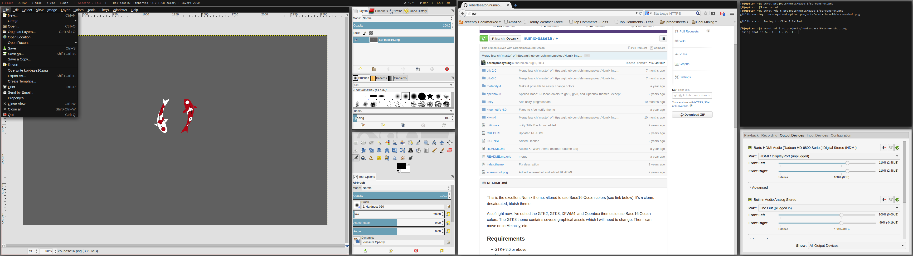

Numix, but modified to use the colors from the base16 color scheme. Tested against gtk2, but should work with gtk3, metacity, openbox, unity, xfce-notify, and xfwm4. 

### Usage

#### Global install

    git clone git@github.com:robertseaton/numix-base16.git
    sudo cp -r numix-base16 /usr/share/themes
    
#### Local install (untested)

    git clone git@github.com:robertseaton/numix-base16.git
    cp -r numix-base16 ~/.themes

Then update your running theme with a program like `lxappearance` or `gtk-chtheme`. 

### Code, license, credits

* I've forked the theme from [Numix-Ocean](https://github.com/aaronjamesyoung/Numix-Ocean), who forked it from the [Numix Theme](https://github.com/shimmerproject/Numix). 
* Color scheme is base16-default, [found here.](https://github.com/chriskempson/base16)

License: GPL-3.0+

### Screenshot

